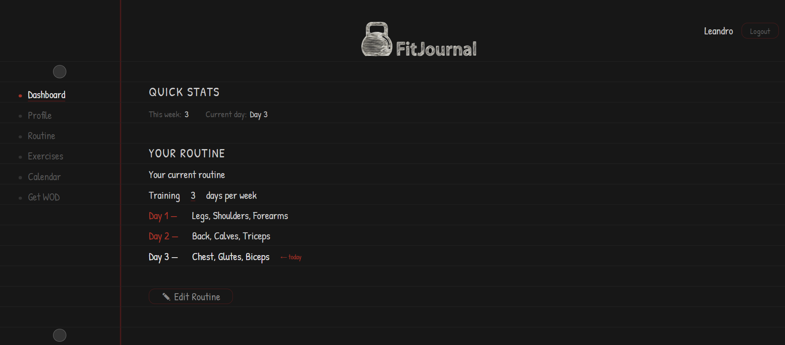
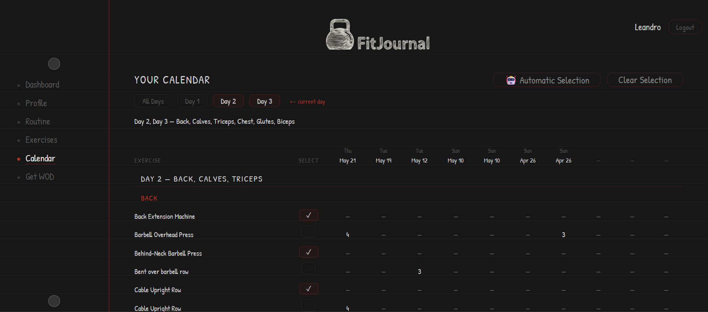
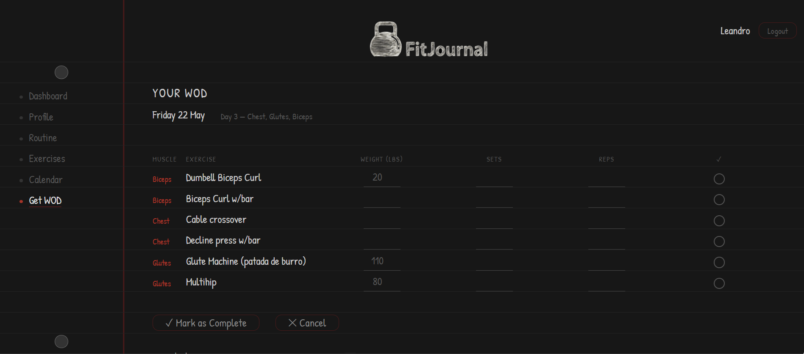

# FitJournal

A self-hosted fitness tracker with a paper-notebook aesthetic — available as a web app and a native Android app, sharing one serverless backend.

> 🎥 **Demo video coming soon.**
>
> 🔗 **Live demo:** _(link coming soon)_

<br>

<p align="center" style="margin-top: 24px;">
  
  <br>
  <em>Dashboard — visualize your basic stats</em>
</p>

<p align="center" style="margin-top: 24px;">
  
  <br>
  <em>Calendar — workout history grouped by day</em>
</p>

<p align="center" style="margin-top: 24px;">
  
  <br>
  <em>Get workout — generate and log your daily workout</em>
</p>

---

## Overview

FitJournal lets you build a weekly training routine, generate daily workouts, log what you actually did, and review your history. It's a full-stack project: a FastAPI backend serving both a server-rendered web app and a native Android client, deployed serverless on AWS for $0/month.

The distinguishing feature is the interface — a "paper notebook" design system (ruled lines, handwritten font, red margin line) applied consistently across the web app, with light and dark modes.

## Tech Stack

**Backend**
- FastAPI (Python), SQLAlchemy 2.0 ORM, Pydantic
- MySQL (PyMySQL driver), JWT auth, bcrypt password hashing
- Jinja2 server-side templating

**Web**
- Jinja2 + vanilla JavaScript, custom `notebook.css` (no framework)

**Android**
- Kotlin, Jetpack Compose, MVI architecture
- Retrofit + OkHttp, Room, encrypted token storage (Android Keystore)

**Infrastructure (AWS)**
- Lambda (FastAPI via Mangum) · API Gateway (HTTP API) · RDS MySQL
- ACM (TLS) · Cloudflare DNS · custom domain `app.fit-journal.com`

## Architecture

```
Web + Android ─► app.fit-journal.com (Cloudflare DNS)
              ─► API Gateway (HTTPS, HTTP API)
              ─► Lambda (FastAPI via Mangum)
              ─► RDS MySQL
```

Both clients talk to the same JWT-authenticated backend; only the backend touches the database. Full detail in [docs/ARCHITECTURE.md](docs/ARCHITECTURE.md).

## Features

- Custom training routines (1–7 days/week, multiple muscle groups per day)
- Automatic workout generation that rotates through least-used exercises
- Per-exercise workout logging with weight tracking over time
- Workout history calendar with multi-day filtering and per-day grouping
- Personal exercise library (101 starter exercises, fully editable per user)
- JWT authentication shared across web and mobile
- Timezone-aware logging; metric/imperial unit preferences
- Notebook-style UI with light and dark modes
- Android app with drag-to-reorder, inline editing, and offline-aware token handling

## Running Locally

**Prerequisites:** Python 3.8+, a MySQL 8.0+ instance, Git. (Android Studio for the mobile app — see [README_mobile.md](README_mobile.md).)

```bash
# 1. Clone
git clone https://github.com/leanardiles/fit-journal.git
cd fit-journal

# 2. Virtual environment
python -m venv venv
source venv/Scripts/activate     # Windows (Git Bash)
# source venv/bin/activate        # macOS / Linux

# 3. Dependencies
pip install -r requirements.txt

# 4. Environment — create src/.env
#    DB_HOST, DB_PORT, DB_USER, DB_PASSWORD, DB_NAME, DB_SSL, SECRET_KEY

# 5. Run
cd src
uvicorn main:app --reload
```

Web app: `http://127.0.0.1:8000/web/login` · API docs: `http://127.0.0.1:8000/docs`

> The backend serves both the API and the web frontend — no separate frontend server. Any MySQL 8.0+ instance works (local or managed); the `.env` file is gitignored.

## Deployment

The backend runs on AWS Lambda behind API Gateway, deployed via a GitHub Actions pipeline: it builds the package (forcing Lambda-compatible `manylinux2014` wheels), runs the test suite, and — only if tests pass — deploys to Lambda using short-lived OIDC credentials (no stored AWS keys). The full pipeline and architecture reasoning are in [docs/ARCHITECTURE.md](docs/ARCHITECTURE.md).

## Testing

**Backend** — a pytest suite (21 tests) covers authentication, authorization, exercise/routine CRUD, profile, workout generation, and page loads, run against a disposable MySQL test database. The suite runs in CI (GitHub Actions) against a MySQL service container *before* every deploy — a failing test blocks the deploy.

```bash
pip install pytest httpx
pytest -v        # run the backend suite locally (needs a MySQL test DB)
```

**Android** — 83% unit test coverage (JaCoCo), covering ViewModels and repository logic through fake implementations, plus two instrumented UI tests (login happy path and error path).

```bash
cd mobile
./gradlew testDebugUnitTest jacocoTestReport     # unit tests + coverage
./gradlew connectedDebugAndroidTest              # UI tests (needs an emulator)
```

## Documentation

- [docs/ARCHITECTURE.md](docs/ARCHITECTURE.md) — system design, deployment, key decisions
- [docs/SCHEMA.md](docs/SCHEMA.md) — database schema
- [docs/design-system.md](docs/design-system.md) — UI/UX design system
- [README_mobile.md](README_mobile.md) — Android app setup
- [ROADMAP.md](ROADMAP.md) — planned features and technical debt

## Status

Actively developed. The web and Android apps are functional and deployed, with a CI/CD pipeline (GitHub Actions) that runs a backend test suite before each deploy. Current focus is broadening test coverage, pointing the Android app at the production backend, and a marketing landing page. See [ROADMAP.md](ROADMAP.md).

## License

MIT — see [LICENSE](LICENSE).